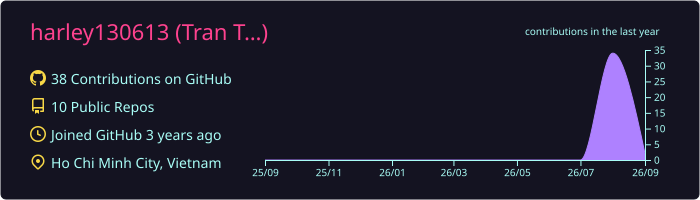
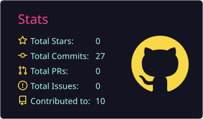
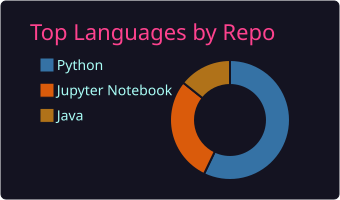
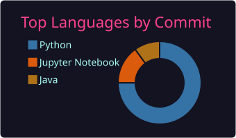

<!-- ===== HEADER ===== -->


<h1 align="center">Trần Thị Cẩm Loan</h1>
<p align="center"><sub>Data Analyst &nbsp;·&nbsp; Marketing, CRM &amp; Customer Analytics</sub></p>

<p align="center">
  
</p>

<hr/>

<!-- ===== ABOUT ME ===== -->
<h2>🖥️ about me</h2>

```bash
$ cat about_me.txt
```

I'm **Cẩm Loan (Harley)** - a Data Analyst at an **app-based driver service platform** in Vietnam.
I dig into **500K+ trips and 400K+ users** to find where customers drop off, why they don't come back,
and which campaigns actually pay off. I build dashboards, design CRM & voucher programs,
and automate reporting so the team can move faster. Currently **open to Data Analyst roles**
in Marketing, CRM and Customer Analytics.

<!-- ===== TECH STACK ===== -->
<p align="center">
  
  
  
  
  
  
  
  
  
  
  
  
  
  
</p>

<hr/>

<!-- ===== GITHUB ACTIVITY (auto-generated daily by GitHub Actions) ===== -->
<p align="center">
  
</p>

<p align="center">
  
  
</p>

<p align="center">
  
  
</p>

<hr/>

<!-- ===== PROJECTS ===== -->
<h2>📂 featured projects</h2>

| Project | Key result |
|---|---|
| 🧲 [**New-Customer Promotion Program**](https://github.com/harley130613/new-user-promotion_program_project) — milestone-based vouchers + cohort dashboard | **50% R0**, **30% R30**, +10.4 pp vs baseline |
| 🔁 [**Reactivating Dormant Customers**](https://github.com/harley130613/remarketing_dormant_project) — CRM segmentation + voucher A/B tests | **38% CVR**, **30.02%** redemption on 10K vouchers |
| 📱 [**Paid Ads Attribution (Airbridge)**](https://github.com/harley130613/paid-ads-attribution-analytics) — ROAS & CAC Index across 4 ad channels | Apple Search **8.42x** vs Facebook **0.69x** ROAS |
| 📈 [**BI Dashboard & Demand Forecasting**](https://github.com/harley130613/Bi-demand-forecasting-project) — Gradient Boosting by day & region | **MAPE 26.75%**, 13.35 pp better than baseline |
| 🎟️ [**Voucher Conversion Optimization**](https://github.com/harley130613/MKT-voucher-conversion-optimization) — targeting, expiry, timing, allocation | Data-backed uplift plan |
| 🚗 [**Ride-hailing Marketplace Analysis**](https://github.com/harley130613/data-portfolio-butl) — funnel, campaign ROI, driver supply | End-to-end SQL + Python |

<hr/>

<!-- ===== WINS ===== -->
<h3 align="center">🏆 wins</h3>

<p align="center">
  <sub>🥇 <b>2025</b> — Outstanding Contribution Employee of the Year</sub><br/>
  <sub>⭐ <b>2026</b> — Recognized for Positive Contribution through Analytical Reporting</sub><br/>
  <sub>📊 <b>+33.5%</b> YoY trips &nbsp;·&nbsp; <b>−50%</b> cancelled trips &nbsp;·&nbsp; <b>+40%</b> new-user conversion &nbsp;·&nbsp; <b>+20%</b> return rate</sub>
</p>

<hr/>

<!-- ===== CONTACT ===== -->
<h3 align="center">let's talk data.</h3>

<p align="center">
  <sub>📍 Ho Chi Minh City, Vietnam</sub>
</p>

<p align="center">
  <a href="https://www.linkedin.com/in/cloan02/"></a>
  <a href="mailto:tranthicamloan1301@gmail.com"></a>
  <a href="https://canva.link/fnhii8z1eit5jjf"></a>
</p>

<p align="center">
  
</p>

<!-- ===== FOOTER ===== -->

